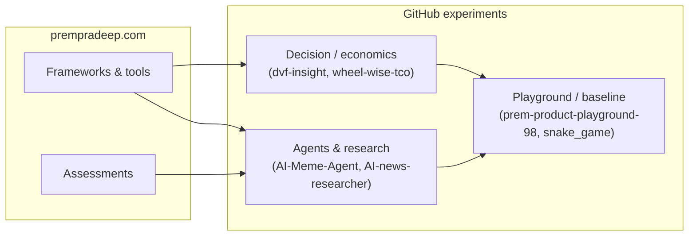

<pre align="center">
┌─────────────────────────────────────────────────────────────┐
│  PREM PRADEEP  ·  PRODUCT · TOOLS · SYSTEMS                │
└─────────────────────────────────────────────────────────────┘
</pre>

**Thesis:** Product judgment improves when thinking is **externalized**—into frameworks, instruments, and code—so teams can inspect, iterate, and reuse it.

[Website](https://www.prempradeep.com/) · [LinkedIn](https://www.linkedin.com/in/prempradeep/) · [ORCID](https://orcid.org/0009-0009-4940-7884)

---

## I. Operating model

| Layer | Role | Primary surface |
|:------|:-----|:----------------|
| **Cognitive** | Make trade-offs legible (prioritization, DVF, JTBD, metrics) | [Tools & assessments](https://www.prempradeep.com/) |
| **Instrumental** | Turn abstractions into repeatable workflows (generators, planners, dashboards) | Same hub; outputs are **auditable artifacts** |
| **Computational** | Stress-test ideas with agents, models, and thin vertical slices | Repositories below |

Design rule: each layer must **compose**—frameworks feed tools; tools inform experiments; experiments tighten the next framework revision.

---

## II. Architecture of the public hub

The site is structured as a **portfolio of decision systems**, not a blog: discrete tools, linked assessments, and vocabulary (ProdZ) that reduce ambiguity in product conversations.

| Class | Examples (on-site) |
|:------|:-------------------|
| **Planning & narrative** | User Story Generator, Product Roadmap Planner |
| **Allocation & scoring** | Feature Prioritization (RICE, MoSCoW, …), DVF Exercise, Advanced DVF (NPV / IRR / payback, portfolio view) |
| **Understanding demand** | Jobs to Be Done |
| **Measurement** | Product Metrics Dashboard |
| **Governance & ethics** | PM Competency Assessment, Dark Patterns Website Assessment |

**SaaS verticals** (applied systems): [Academic Micro SaaS](https://www.prempradeep.com/saas/academic-micro-saas) · [PreJoin IQ](https://www.prempradeep.com/saas/prejoin-iq)

---

## III. Repository topology (this account)

Classification by **intent**, not star count.

| Intent | Repository | Stack | Analytical note |
|:-------|:-----------|:------|:----------------|
| **Decision insight** | [`dvf-insight`](https://github.com/prempradip/dvf-insight) | TypeScript | Explores how DVF-style judgment is surfaced in software |
| **Economic framing** | [`wheel-wise-tco`](https://github.com/prempradip/wheel-wise-tco) | TypeScript | Total cost and trade-off visibility as a first-class object |
| **Agentic media** | [`AI-Meme-Agent`](https://github.com/prempradip/AI-Meme-Agent) | TypeScript | Bounded agent behavior: creative output with constrained inputs |
| **Information synthesis** | [`AI-news-researcher`](https://github.com/prempradip/AI-news-researcher) | Python | Retrieval + reasoning over noisy streams |
| **Exploration surface** | [`prem-product-playground-98`](https://github.com/prempradip/prem-product-playground-98) | TypeScript | Sandboxed product hypotheses and UI mechanics |
| **Baseline interaction** | [`snake_game`](https://github.com/prempradip/snake_game) | HTML | Minimal state machine + loop; useful as a control |

---

## IV. System map (how the pieces relate)

Interpretation: the **hub** encodes stable mental models; **repos** test where those models break when automated or scaled.

---

## V. Implementation substrate

  
  
  
  

TypeScript dominates where **typed boundaries** matter (UI, agents, financial scaffolding). Python where **pipeline ergonomics** and research scripts dominate. HTML where the problem is deliberately **small surface area**.

---

## VI. Telemetry (account dynamics)

*Stats are descriptive, not normative—they summarize activity distribution, not merit.*

---

**Closing invariant:** If an idea survives contact with **structure**, **users**, and **code**, it earns a place in the stack.

